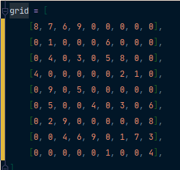
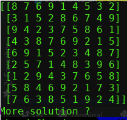

 [](https://github.com/psf/black)


# Sudoku Solver  

  
  

 Developer : Hamdy Abou ElAnein                                                                                              
  hamdy.aea@protonmail.com  

  This is a Sudoku Solver. Replace the numbers you need in the code with 0. If it's more than one solution it will show you all other solutions.

  It need the numpy library.
```sh 
pip install numpy

```
